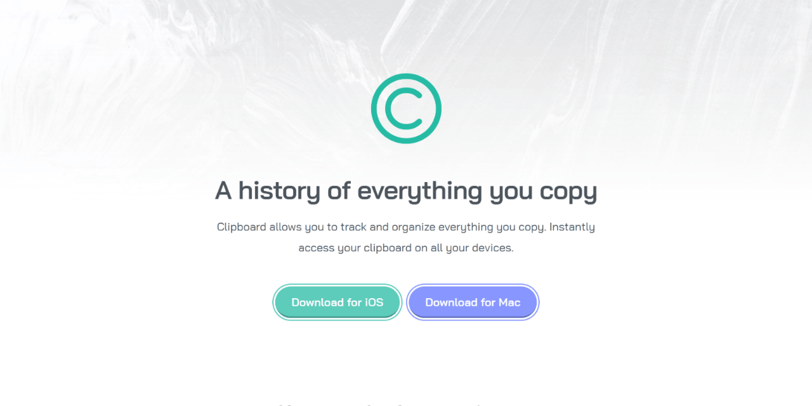

# 🚀 Clipboard landing page solution – Frontend Mentor

A responsive landing page built with **semantic HTML and modern CSS architecture**, following a mobile-first approach and focusing on scalability, accessibility, and clean component structure.

This is a solution to the [Clipboard landing page challenge on Frontend Mentor](https://www.frontendmentor.io/challenges/clipboard-landing-page-5cc9bccd6c4c91111378ecb9). 

---
## 🔗 Links

- 🌎 [Live site](https://vimpdev.github.io/fem-junior-htmlcss-01-clipboard-landing-page/)
- 📌 [Frontend Mentor Solution](https://www.frontendmentor.io/solutions/clipboard-landing-page-mobile-first-bem-and-css-layer-jZekum3B9Q)

---

## 🎬 Demo

---

## 📸 Screenshots

| 📱 Mobile | 📲 Tablet |
| --- | --- |
|  |  |

| 🖥️ Desktop | 🖱️ Interaction |
| --- | --- |
|  |  |

---

## 🎯 The challenge

Users should be able to:

- View the optimal layout for the site depending on their device's screen size
- See hover states for all interactive elements on the page

---

## 📌 Overview

This project focuses on building a maintainable and scalable UI using:

- Semantic HTML structure
- BEM-inspired naming conventions
- CSS `@layer` for architecture separation
- Reusable layout utilities (`stack`, `cluster`)
- Accessible interactive elements  

---

## ⚙️ Built with

- Semantic HTML5
- CSS custom properties (design tokens)
- CSS Grid & Flexbox
- Mobile-first workflow
- CSS architecture with `@layer`

---

## 🧠 Key Learnings

- Structuring scalable CSS using `@layer` (tokens, base, layout, components, section)
- Designing reusable layout patterns (`stack`, `cluster`)
- Naming consistency with BEM without over-coupling components
- Handling complex responsive layouts with CSS Grid
- Improving accessibility with semantic HTML and `aria-*`

---

## 🤖 AI Collaboration

AI was used as a support tool during the project:

- Code review and iterative refinement  
- Exploring naming conventions and CSS architecture  
- Validating layout and responsive design decisions  

It helped improve decision-making and maintain consistency across the codebase.

---

## 👤 Author

- Frontend Mentor – [@vimpdev](https://www.frontendmentor.io/profile/vimpdev)

---